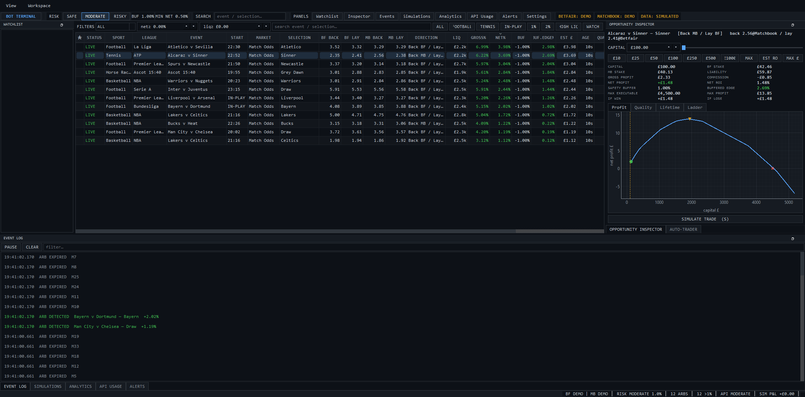
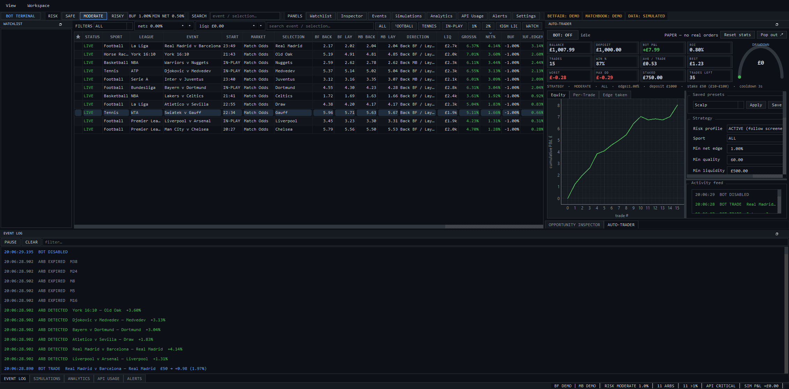
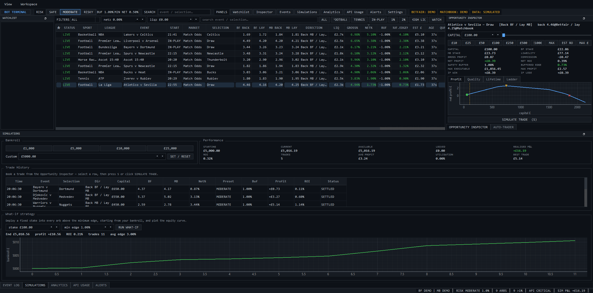
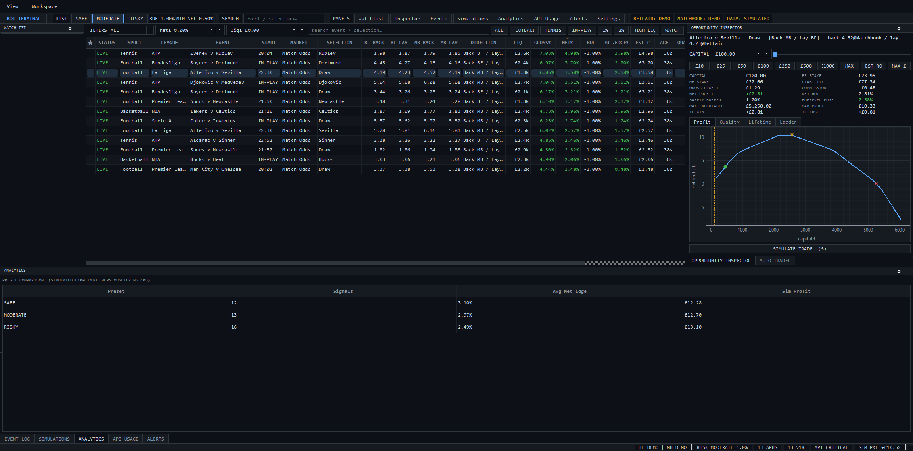
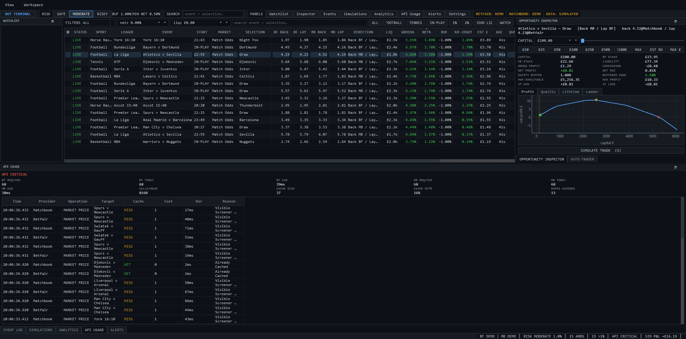

<div align="center">

# MarketSync

**A cross-exchange betting arbitrage scanner and analysis terminal.**

Finds the same market priced differently on two exchanges, and reports only the
edge that survives commission.

[](https://www.python.org/)
[](https://doc.qt.io/qtforpython-6/)
[](https://pyodide.org/)
[](LICENSE)

### [▶ Try the live terminal](https://ziyanrq.github.io/MarketSync-Prediction-Market-Screener-and-Autonomous-Bot/)

<sub>Runs the project's real Python detection engine in your browser via
WebAssembly. No install, no clone.</sub>

</div>



<div align="center">
<sub>The desktop terminal: screener, opportunity inspector with a depth-aware
profit curve, and the event log flagging arbitrage as it opens and expires.</sub>
</div>

---

## What it does

A betting **exchange** has no house setting the odds — prices are other users'
back/lay offers, and the exchange takes commission on winnings. That normally
makes the market efficient. MarketSync hunts the exceptions, of three kinds:

| | |
|---|---|
| **Under-round book** | Sum `1/best_back` across every runner in a market. Under 100% on a complete book means backing *every* outcome profits whoever wins. |
| **Combined-back under-round** | The same sum, but taking the best back price per runner across **both** exchanges. Goes under 100% far more often, because each leg is cherry-picked. |
| **Back/lay cross arb** | Where the best **back** price on one venue exceeds the best **lay** price on the other, back there and lay here to lock the difference either way. |

Every flagged edge is reported as a **worst-case net after commission**, never as
the headline gap. The reasoning is [below](#being-honest-about-the-number).

Built while learning Python, software engineering and quantitative finance.

## The terminal

A dense desktop workstation (PySide6 + pyqtgraph) for studying opportunities, on
simulated data — no credentials, no live requests.

<table>
<tr>
<td width="50%"><br>
<sub><b>Auto-trader</b> — paper trading with configurable execution slippage, so
the win rate, drawdown gauge and equity curve show realistic variation rather
than a straight line.</sub></td>
<td width="50%"><br>
<sub><b>Simulations</b> — bankroll, booked paper trades, and a what-if equity
curve for a fixed stake deployed into every qualifying arb.</sub></td>
</tr>
<tr>
<td width="50%"><br>
<sub><b>Analytics</b> — preset comparison: how many signals each risk preset
surfaces, at what average edge, for what simulated profit.</sub></td>
<td width="50%"><br>
<sub><b>API usage</b> — per-venue request budget and a call inspector showing
cache hits, cost and latency. Mock, but shaped for a live integration.</sub></td>
</tr>
</table>

Panels can be dragged to any edge, floated, tabbed or popped into their own
window. Layout, presets, watchlist and trade history persist locally
(`QSettings` + SQLite).

<sub>Screenshots captured from the running app by
[`scripts/capture_screenshots.py`](scripts/capture_screenshots.py).</sub>

## The scanner

The part that talks to real exchanges.

| Module | What it does |
|---|---|
| [`src/matchbook.py`](src/matchbook.py) | Session auth, sports/events, and full back/lay ladders in a single `include-prices` call. Same-exchange under-round scanner with a polling loop that re-authenticates itself. |
| [`src/betfair.py`](src/betfair.py) | Interactive login and one generic `rpc()` helper every Betting API call routes through. Catalogue and market book joined on `marketId`/`selectionId`, price requests chunked at 25 markets to stay under Betfair's data cap. |
| [`src/cross_exchange.py`](src/cross_exchange.py) | Matching, both cross-venue detectors, commission-aware rating, and a poll loop that reports arbs as **transitions** — once when they open, once when they close. |

## How it works

### Matching two exchanges that share no IDs

The venues have no common identifiers and spell things differently, so markets
are reconciled by name in three widening steps: normalise (lowercase, strip
punctuation and noise tokens like `fc`/`afc`), canonicalise market names so
Matchbook's *Moneyline* meets Betfair's *Match Odds*, then fuzzy-match with
`difflib` against separate thresholds for events (0.80) and runners (0.82).

The alias tables are kept deliberately tiny. Aggressive aliasing causes *false*
matches — and a false match invents an arbitrage that does not exist, which is
the worst failure this program has. Because of that, `preview` mode is a
first-class feature: it prints both venues' events with every near-miss
similarity score, so "zero arbs" can be diagnosed as *no shared events* versus
*threshold too high* before any number is trusted.

Scans are **anchored on Matchbook**: its events call returns prices in one
request, so Betfair's expensive price call is only made for events that actually
overlap.

### Being honest about the number

A naive scanner reports the raw gap and looks brilliant. This one reports the
worst-case guaranteed net:

1. Size stakes by equal-profit dutching (proportional to `1/odds`).
2. For **every possible winner**, compute the net position *per exchange*.
3. Charge each venue's commission **only where that venue actually nets a win** —
   commission is on net market winnings, so a losing venue is not charged.
4. Report the **minimum** across all outcomes.

Steps 2–3 are the ones that matter: charging on the gross position, or at a
blended rate, gives a materially wrong answer whenever legs are spread across
venues at different rates.

Each opportunity is then rated against a slippage cushion — `SAFE`, `THIN` or
`SKIP` — via three presets:

| Preset | Safety buffer | Min net edge | Use |
|---|---|---|---|
| `safe` | 2.0% | 2.0% | only comfortably clear arbs |
| `moderate` *(default)* | 1.0% | 0.5% | real edges with a small cushion |
| `risky` | 0.0% | 0.01% | anything net-positive, no cushion |

### Sizing against real depth

The terminal's maths is depth-aware: stakes **walk the ladder**, so larger stakes
fill at progressively worse prices and ROI falls as capital rises. That is what
makes "max executable stake" and the profit-vs-capital curve meaningful — a 4%
edge on £20 of available liquidity is not a 4% edge on £2,000.

## Running it

```bash
pip install -r requirements.txt        # scanner
pip install -r app/requirements.txt    # desktop terminal
```

```bash
# Cross-exchange scan, one pass (the main event)
python src/cross_exchange.py

# Continuously — each arb printed once when it opens, once when it closes
python src/cross_exchange.py loop

# Pick a risk preset (default: moderate)
python src/cross_exchange.py loop safe

# Zero matches? See what each venue returned, with near-miss scores,
# before trusting any arb output
python src/cross_exchange.py preview

# Single-exchange under-round scanner, polling
python src/matchbook.py

# Desktop terminal (simulated data, no credentials needed)
python app/main.py

# Web preview, served locally
python web/build.py && python -m http.server 8765 --directory web
```

```bash
# Tests: arbitrage maths + the Qt boundary the web build depends on
python tests/test_calculations.py && python tests/test_no_qt_imports.py
```

## Setup

Credentials go in a gitignored `.env` at the project root:

```
MATCHBOOK_USERNAME=
MATCHBOOK_PASSWORD=

BETFAIR_USERNAME=          # account username, NOT email
BETFAIR_PASSWORD=
BETFAIR_APP_KEY=           # the free delayed key works unchanged
```

Two things that cost real time to discover: Betfair's interactive login wants the
account **username, not the email address**, and its **delayed** application key
is free and runs this code unchanged (prices lag 1–3 minutes), while the live key
is a one-off charge. Delayed data is fine for validating detection — see
[`docs/resources.md`](docs/resources.md).

## Project structure

```
src/         Live scanner — Matchbook + Betfair clients, cross-exchange engine
app/         PySide6 desktop terminal (simulated data)
web/         Browser preview — real engine via Pyodide, UI in HTML/JS
tests/       Arbitrage maths + Qt-boundary guard
scripts/     Screenshot capture for the desktop app
docs/        Architecture, roadmap and API reference
```

The web preview is not a reimplementation: `models/`, `providers/`, `utils/` and
four of the services import no Qt at all, so the browser runs **that code
unmodified** under Pyodide and only the UI is rewritten. A test enforces the
boundary that makes this possible.

## Docs

- [`docs/architecture.md`](docs/architecture.md) — how the scanner and terminal
  are structured, why the two exchange clients look different, and how markets
  are matched across venues with no shared IDs.
- [`docs/roadmap.md`](docs/roadmap.md) — what's done, what's next, and the known
  debt (including why delayed Betfair prices mean nothing here is executable yet).
- [`docs/resources.md`](docs/resources.md) — exchange API access and costs, the
  endpoints in use, and the gotchas behind each.
- [`web/README.md`](web/README.md) — how the browser preview runs the real Python
  engine, and how to build and deploy it.

## Roadmap

- [x] Matchbook and Betfair API clients
- [x] Same-exchange under-round scanner with a commission check
- [x] Polling loops with automatic re-authentication
- [x] Cross-venue matching across mismatched naming
- [x] Combined-back and back/lay cross-exchange detectors
- [x] Worst-case net-of-commission sizing, safety ratings and risk presets
- [x] Desktop analysis terminal, and a browser preview running the real engine
- [ ] Persist flagged opportunities and alert on them
- [ ] Stake sizing against real available liquidity, not just best price
- [ ] Wire the live providers into the desktop terminal

## Tech

Python · [`requests`](https://requests.readthedocs.io/) · `python-dotenv` ·
`difflib` · [PySide6](https://doc.qt.io/qtforpython-6/) · `pyqtgraph` ·
[Pyodide](https://pyodide.org/) · the Matchbook Exchange REST API and the Betfair
Exchange Betting API.

## Disclaimer

A research and analysis tool. It places no bets and moves no money — the
terminal's trading is paper only. Flagged opportunities are theoretical and
assume both legs can be matched at the prices shown, which in a live market they
often cannot.
